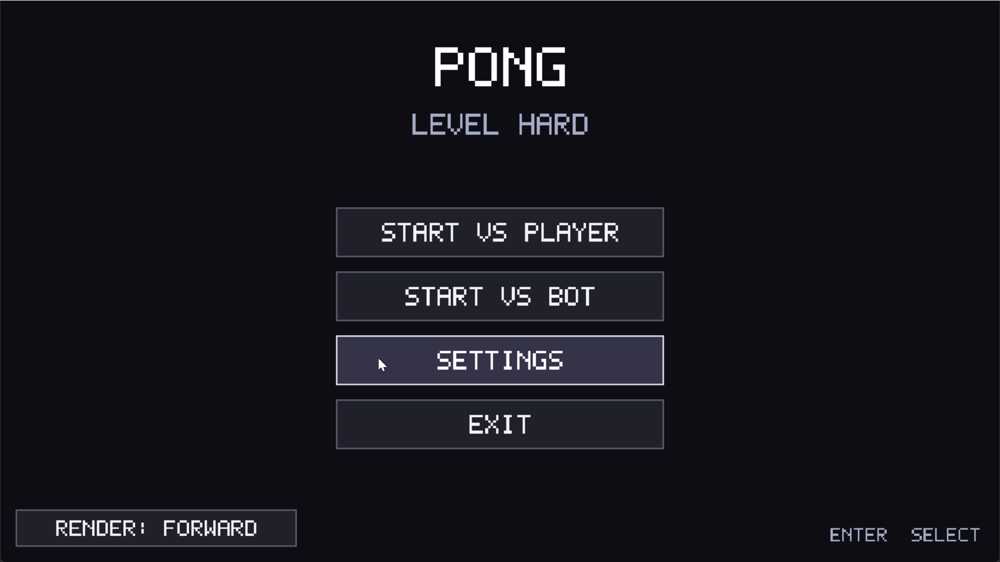
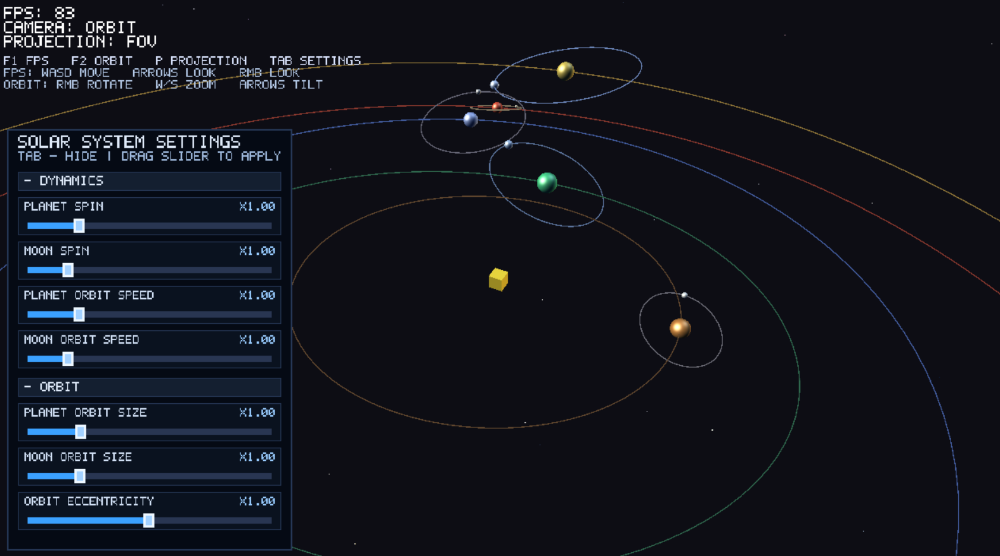
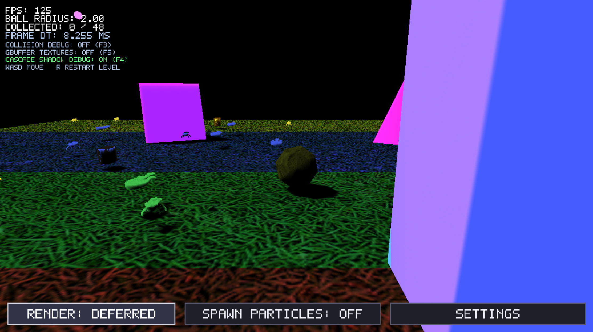
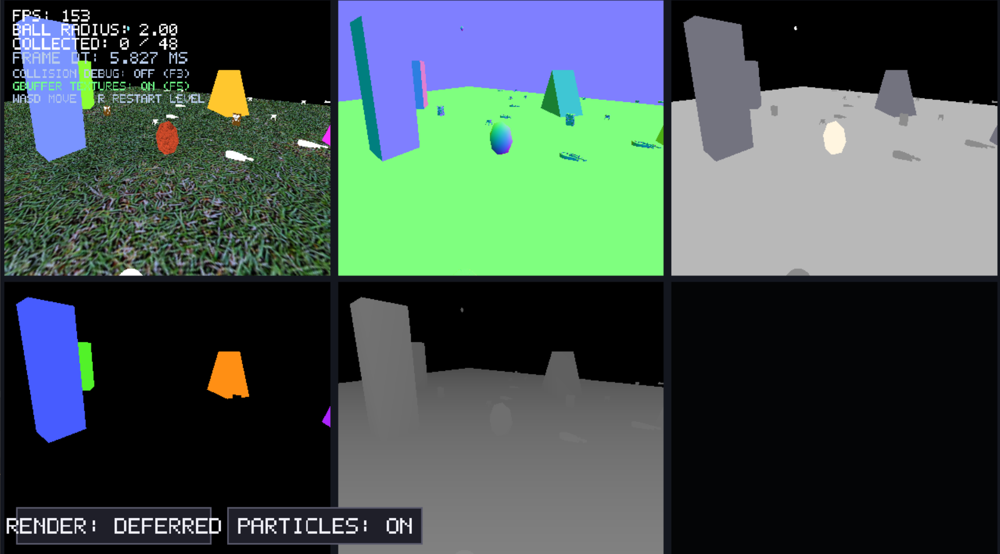
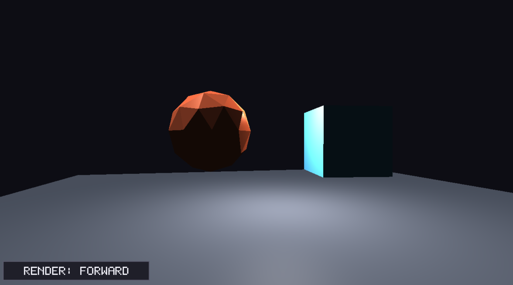

# Mini Engine With Games

Small C++20/DirectX 11 game engine playground with a shared core and multiple playable mini-games/demos running on top of one application runtime.

Russian version: **[README_RU.md](README_RU.md)**

---

## Table of Contents

- [Overview](#overview)
- [Games and Demos](#games-and-demos)
- [Current Features](#current-features)
- [Project Architecture](#project-architecture)
- [Controls](#controls)
- [Build Requirements](#build-requirements)
- [Build and Run](#build-and-run)
- [Project Structure](#project-structure)

---

**Preview (static):** large motion captures are kept out of Git to keep the repo small. Use the Katamari screenshots below, or attach a short compressed clip to a **GitHub Release** for this repository.


## Overview

The repository started as a Pong project (`PingPong`) and evolved into a compact game engine framework:

- `Core` provides platform/window, app loop, input, rendering, audio, assets, UI, math, and gameplay systems.
- `Game/*` contains independent game modules implementing one interface (`IGame`).
- `main.cpp` selects which module is launched at runtime.

The executable target is still named `PingPong`, but it now hosts multiple game modes.

---
## Games and Demos

### Pong (`Game/Pong`)

Classic 2D Pong mode with menu flow and match logic:

- Why it exists:
  - Baseline "arcade game" module using shared app/runtime APIs
  - Fast validation target for input, UI, audio, and 2D rendering changes
- What it provides:
  - Player vs Player / Player vs Bot
  - Difficulty and match-rule flow
  - Main menu, in-game HUD, and game-over screens
  - Sound effects + looping music
#### Game play 


#### Screenshots
The main menu


Gameplay


### SolarSystem (`Game/SolarSystem`)

Interactive 3D solar system sandbox:

- Why it exists:
  - 3D simulation-style testbed for cameras, UI controls, and scene updates
  - Demonstrates non-combat/non-arcade interaction patterns
- What it provides:
  - Orbit and FPS camera modes
  - Orbital body rendering and orbit visualization
  - Live tuning panel for rotation/orbit parameters
  - Movement-driven engine audio feedback
#### Game play

Still frame (avoid ~20MB+ GIFs in the repo; compress locally or host on Releases):



### Katamari (`Game/Katamari`)

3D rolling-ball mini-game with ECS systems and rendering experiments:

- Why it exists:
  - Main advanced 3D gameplay sandbox in this repository
  - Stress-tests ECS flow, collisions, rendering modes, and debug passes
- What it provides:
  - Roll, absorb, and grow gameplay loop
  - Follow camera with smoothing
  - Deferred rendering workflow integration
  - Particle spawn/settings UI
  - Collision debug draw, shadow cascade debug, GBuffer debug

Screenshots:





### LightingTest (`Game/LightingTest`)

Compact technical scene used for model/material/lighting/camera validation.

- Why it exists:
  - Lightweight visual lab for rendering checks without full gameplay complexity
- What it provides:
  - Focused environment for lighting/material/camera sanity checks

Screenshot:

---

## Controls

### Global

- `Esc` - exit application (supported in active game logic)

### Demo Selection

Switch the active game in `main.cpp`:

```cpp
constexpr auto demo = DemoType::Katamari;
```

Available options:

```cpp
DemoType::Pong
DemoType::SolarSystem
DemoType::Katamari
DemoType::LightingTest
```

### SolarSystem

- `F1` - FPS camera
- `F2` - Orbit camera
- `P` - projection mode toggle
- `Tab` - settings panel
- `W`, `A`, `S`, `D` - movement / zoom (depending on camera mode)
- Arrow keys - look/orbit adjustments
- `RMB` - mouse look/orbit rotation

### Katamari

- `W`, `A`, `S`, `D` - movement
- `Space` - jump
- `R` - level reset
- `F3` - collision debug draw
- `F4` - shadow cascade debug
- `F5` - GBuffer debug visualization
- `RMB` - camera control

---

## Current Features

The engine is intentionally compact, but already covers a full playable game loop stack:

- **Application Runtime**
  - Unified game lifecycle through `IGame` (`Initialize`, `Update`, `Render`, `Shutdown`)
  - Shared runtime context (`AppContext`) used by all game modules
  - One executable, multiple game modules selected at compile-time in `main.cpp`

- **Rendering**
  - 2D + 3D rendering on DirectX 11
  - Forward and deferred render modes
  - Multi-pass frame pipeline (`Core/Graphics/Rendering/Pipeline`)
  - Directional + point light support, shadow mapping, and debug visualizations
  - GBuffer debug mode and shadow cascade debug mode
  - GPU particles (integrated into Katamari flow)

- **Gameplay Foundation**
  - Lightweight ECS-style scene flow (`Scene`, entities, components, systems)
  - Built-in transform, velocity, collision, and render update systems
  - 2D and 3D collision helpers
  - Reusable camera logic (FPS, orbit, follow camera styles)

- **Tooling and Content Runtime**
  - Asset loading for models and textures (Assimp path)
  - Runtime shader files copied into build output automatically
  - Built-in UI widgets and debug overlays
  - Audio integration via DirectXTK Audio

---

## Project Architecture

### `Core/App`

Application bootstrap and frame loop:

- `Application` owns startup/shutdown, timing, update loop, and render loop
- `IGame` defines the contract every game module must implement
- `AppContext` exposes platform/window/input/graphics/audio/assets/UI services
- `ApplicationDefaults.h` keeps default window sizing (`1280x720`)

Responsibility: this layer is the "host shell" that keeps game modules decoupled from low-level initialization.

### `Core/Graphics`

Rendering stack and rendering pipeline:

- `GraphicsDevice` initializes and owns D3D11 resources and frame targets
- `ShapeRenderer2D` handles 2D primitives and UI rendering helpers
- `PrimitiveRenderer3D` handles debug/simple 3D primitives
- `ModelRenderer` renders imported model assets with material/light data
- `FrameRenderer` orchestrates frame execution and render mode behavior
- Render passes live in `Core/Graphics/Rendering/Pipeline/Passes`
  - Deferred path includes geometry, lighting, and composite passes
  - Additional passes exist for shadows, particles, overlays, and UI

Responsibility: this is the rendering subsystem plus frame orchestration logic.

### `Core/Gameplay`

Gameplay foundation for 3D scenes:

- `Scene` implements entity/component/system orchestration
- Components include transform/model/material/velocity/collider/tag/attachment data
- Systems include transform propagation, velocity integration, collision, and rendering
- Additional game-specific systems can be plugged in per module

Responsibility: reusable gameplay runtime for features that should not be rewritten per game.

### Other Core Modules

- `Core/Input` - keyboard/mouse state and raw input deltas
- `Core/Audio` - sound loading, one-shots, looped sounds, runtime control
- `Core/Assets` - path resolving and cached asset loading
- `Core/UI` - bitmap font drawing and custom UI widgets
- `Core/Physics` - shared collision/math structures and queries
- `Core/Math` - transforms and helper math utilities

---

## Build Requirements

Current setup is Windows-focused:

- Windows 10/11
- CMake 3.21+
- C++20 compiler (Visual Studio/MSVC recommended)
- [vcpkg](https://github.com/microsoft/vcpkg)

Dependencies (from `CMakeLists.txt`):

- `directxtk`
- `assimp`

System libraries:

- `d3d11`, `dxgi`, `d3dcompiler`, `dxguid`, `user32`, `gdi32`

---

## Build and Run

This project is expected to be built in **Debug** during active development.

### A) vcpkg Setup (first time)

1. Clone and bootstrap `vcpkg`:

```powershell
git clone https://github.com/microsoft/vcpkg.git C:\dev\vcpkg
cd C:\dev\vcpkg
.\bootstrap-vcpkg.bat
```

2. Optional but recommended environment variables for the current terminal session:

```powershell
$env:VCPKG_ROOT="C:\dev\vcpkg"
$env:Path="$env:VCPKG_ROOT;$env:Path"
vcpkg version
```

3. Install required ports:

```powershell
vcpkg install directxtk:x64-windows assimp:x64-windows
```

### B) Configure the project with CMake + vcpkg toolchain

From repository root:

```powershell
cmake -S . -B cmake-build-debug `
  -G "Visual Studio 17 2022" `
  -A x64 `
  -DCMAKE_TOOLCHAIN_FILE=C:/dev/vcpkg/scripts/buildsystems/vcpkg.cmake `
  -DVCPKG_TARGET_TRIPLET=x64-windows
```

Notes:

- `-DCMAKE_TOOLCHAIN_FILE=.../vcpkg.cmake` is required for `find_package(directxtk)` and `find_package(assimp)` to resolve correctly.
- `x64-windows` must match installed triplets.

### C) Build (Debug)

```powershell
cmake --build cmake-build-debug --config Debug
```

Expected binary:

- `cmake-build-debug/PingPong.exe`

### D) Run

```powershell
.\cmake-build-debug\PingPong.exe
```

### E) Select which game runs

`main.cpp` selects the active module:

```cpp
constexpr auto demo = DemoType::Katamari;
```

Available options:

```cpp
DemoType::Pong
DemoType::SolarSystem
DemoType::Katamari
DemoType::LightingTest
```

### F) What CMake copies for runtime

`CMakeLists.txt` copies runtime data into the build folder:

- `Core/Shaders`
- `Game/Pong/Assets`
- `Game/SolarSystem/Assets`
- `Game/Katamari/Assets` (if the folder exists)

If assets/shaders seem outdated, rebuild the target to trigger copy/sync post-build steps.

---

## Project Structure

```text
Mini-Engine-With-Games/
├── Core/                                  # Shared engine runtime
│   ├── App/                               # App lifecycle, IGame contract, AppContext
│   ├── Platform/                          # Native window integration
│   ├── Input/                             # Keyboard/mouse/raw input
│   ├── Graphics/                          # Device, renderers, cameras, shaders, frame pipeline
│   │   └── Rendering/Pipeline/Passes/     # Frame pass implementations
│   ├── Gameplay/                          # Scene ECS-style data + systems
│   ├── Physics/                           # Collision/math primitives and queries
│   ├── Math/                              # Transform and shared math helpers
│   ├── Assets/                            # Asset resolving/loading/cache
│   ├── Audio/                             # Audio runtime
│   ├── UI/                                # UI framework and widgets
│   └── Shaders/                           # Runtime shader source files
├── Game/                                  # Game-specific modules
│   ├── Pong/                              # 2D arcade gameplay module
│   ├── SolarSystem/                       # 3D simulation-style demo module
│   ├── Katamari/                          # 3D gameplay + debug/render stress module
│   └── LightingTest/                      # Rendering validation scene
├── Images/                                # README screenshots
├── main.cpp                               # Active game selection
└── CMakeLists.txt                         # Build configuration and runtime copy rules
```

---

## Media files and Git

GIFs grow huge quickly (full-screen, long duration, high FPS). This repo **ignores** `Images/game_play.gif` and `Images/solar_game_play.gif` so they are not committed. Keep small assets in Git (for example `pong_game_play.gif` is fine).

**Practical options:**

1. **Compress before committing** (stay roughly under a few MB for README): lower resolution, fewer colors, shorter loop, ~10–15 FPS. Tools: [ezgif.com](https://ezgif.com/optimize), ScreenToGif export settings, or `ffmpeg` (scale + fps + palette).
2. **MP4 in a Release** instead of GIF: much smaller for the same quality; link it from the README.
3. **Git LFS** only if you really need large binaries in Git: install [Git LFS](https://git-lfs.com/), then `git lfs track "*.gif"` before adding. Note GitHub LFS storage and bandwidth quotas.

Example `ffmpeg` idea (adjust width and fps to taste):

```bash
ffmpeg -i game_play.gif -vf "fps=12,scale=960:-1:flags=lanczos,split[s0][s1];[s0]palettegen[p];[s1][p]paletteuse" game_play_small.gif
```
