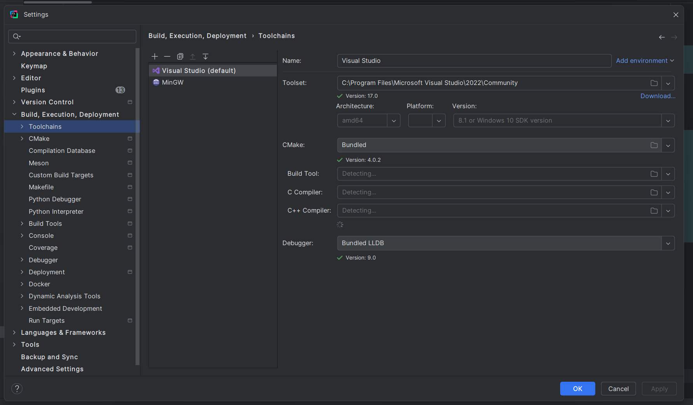

# Installation third-party libraries
Install vcpkg in your pc
```bash
git clone https://github.com/microsoft/vcpkg.git C:\dev\vcpkg
cd C:\dev\vcpkg
.\bootstrap-vcpkg.bat
```
Next you should open your project folder in administration console
```bash
cd <PATH_TO_THE_PROJECT>\PingPong
set "VCPKG_ROOT=C:\dev\vcpkg"
set "PATH=%VCPKG_ROOT%;%PATH%"

vcpkg version

vcpkg new --application
vcpkg add port directxmath
vcpkg add port directxtk
```
Then add to Clion this settings 
``-DCMAKE_TOOLCHAIN_FILE=C:/dev/vcpkg/scripts/buildsystems/vcpkg.cmake -DVCPKG_TARGET_TRIPLET=x64-windows``


and switch to Visual Studio in toolchain

